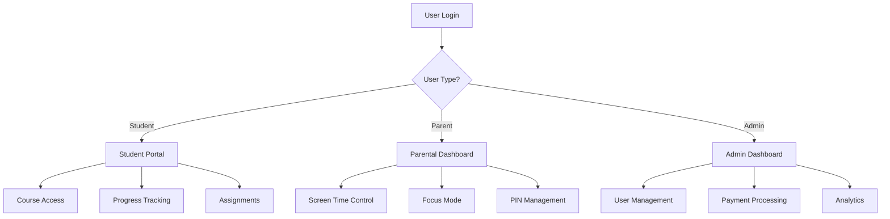

# 📚 Coasted Code - Comprehensive Application Documentation

## Table of Contents
1. [Application Overview](#application-overview)
2. [Architecture & Technology Stack](#architecture--technology-stack)
3. [User Roles & Authentication](#user-roles--authentication)
4. [Core Features & Modules](#core-features--modules)
5. [API Documentation](#api-documentation)
6. [Component Library](#component-library)
7. [Database Schema](#database-schema)
8. [Performance Optimizations](#performance-optimizations)
9. [Deployment & Environment](#deployment--environment)
10. [Development Guide](#development-guide)

---

## Application Overview

**Coasted Code** is a comprehensive hybrid learning platform designed for students aged 6-17, offering AI, Robotics, and Coding education through live online classes, in-person labs, and on-demand content.

### Key Features
- 🎓 **Multi-Modal Learning**: Live classes, in-person labs, and self-paced content
- 🔐 **Secure Authentication**: Firebase-based authentication with role-based access
- 💳 **Payment Integration**: Paystack payment gateway for course enrollment
- 👨‍👩‍👧‍👦 **Parental Controls**: Screen time management, focus mode, and PIN protection
- 📊 **Progress Tracking**: Real-time progress monitoring and analytics
- 🎮 **Interactive Learning**: Games, challenges, and gamified learning experiences
- 📱 **PWA Support**: Progressive Web App with offline capabilities

---

## Architecture & Technology Stack

### Frontend Stack
- **Framework**: Next.js 15.5.0 (App Router)
- **Language**: TypeScript
- **Styling**: Tailwind CSS
- **UI Components**: Custom components with Lucide React icons
- **Animations**: Framer Motion
- **State Management**: React Context API
- **Authentication**: Firebase Auth

### Backend Stack
- **Runtime**: Node.js (Next.js API Routes)
- **Database**: Firebase Firestore
- **Authentication**: Firebase Admin SDK
- **Email Service**: Resend & SendGrid
- **Payment Gateway**: Paystack
- **File Storage**: Firebase Storage

### Development Tools
- **Bundle Analysis**: @next/bundle-analyzer
- **Performance Monitoring**: Lighthouse, Core Web Vitals
- **Code Quality**: ESLint, TypeScript
- **Version Control**: Git

---

## User Roles & Authentication

### User Types

#### 1. **Students** (Primary Users)
- **Age Range**: 6-17 years
- **Access**: Student portal, courses, assignments, games
- **Authentication**: Email/password via Firebase Auth
- **Features**: 
  - Course enrollment and progress tracking
  - Interactive learning modules
  - Assignment submission
  - Gamified learning experiences
  - Parental guidance integration

#### 2. **Parents/Guardians**
- **Access**: Parental control dashboard
- **Features**:
  - Screen time management
  - Focus mode configuration
  - PIN-based access control
  - Progress monitoring
  - Usage analytics

#### 3. **Administrators**
- **Access**: Admin dashboard, user management
- **Features**:
  - User enrollment management
  - Payment processing
  - Content management
  - Analytics and reporting

### Authentication Flow



### Security Features
- **Firebase Authentication**: Industry-standard security
- **Role-based Access Control**: Different permissions per user type
- **Session Management**: Automatic token refresh and expiration
- **Rate Limiting**: API protection against abuse
- **Input Validation**: Zod schema validation
- **CORS Protection**: Cross-origin request security

---

## Core Features & Modules

### 1. Student Portal (`/student`)

#### Dashboard Overview
- **Welcome Section**: Personalized greeting and quick stats
- **Course Progress**: Visual progress indicators for enrolled courses
- **Recent Activity**: Latest assignments, lessons, and achievements
- **Quick Actions**: Direct access to modules, assignments, and games

#### Course Modules (`/student/modules`)
- **Interactive Learning**: Video lessons, coding exercises, and quizzes
- **Progress Tracking**: Real-time completion status and progress bars
- **Skill Assessment**: Automated grading and feedback
- **Certificate Generation**: Upon course completion

#### Assignments (`/student/assignments`)
- **Submission System**: File upload and online submission
- **Deadline Management**: Due date tracking and notifications
- **Grading Interface**: Teacher feedback and score display
- **Resubmission**: Allow multiple attempts with feedback

#### Projects (`/student/projects`)
- **Portfolio Building**: Showcase completed projects
- **Collaborative Tools**: Team project management
- **Version Control**: Project history and iterations
- **Peer Review**: Student-to-student feedback system

#### Games & Activities (`/student/games`)
- **Educational Games**: Coding challenges and puzzles
- **Achievement System**: Badges, points, and leaderboards
- **Skill Practice**: Interactive coding exercises
- **Competition Mode**: Timed challenges and tournaments

#### Guidance System (`/student/guidance`)
- **Focus Mode**: Distraction-free learning environment
- **Screen Time Tracking**: Usage monitoring and limits
- **Break Reminders**: Scheduled rest periods
- **Parental Integration**: Automatic reporting to parents

### 2. Parental Controls (`/guardian`)

#### Screen Time Management
- **Daily Limits**: Set maximum usage time per day
- **Break Scheduling**: Automatic break reminders
- **Usage Analytics**: Detailed time tracking reports
- **Remote Control**: Adjust settings from parent dashboard

#### Focus Mode
- **Session Management**: Start/stop focus sessions
- **Distraction Blocking**: Block non-educational websites
- **Progress Tracking**: Monitor focus session effectiveness
- **Reward System**: Incentives for completing focus sessions

#### PIN Protection
- **Access Control**: PIN-based access to sensitive features
- **Time-based Restrictions**: Schedule-based access control
- **Emergency Override**: Parent override capabilities
- **Activity Logging**: Track all PIN-protected actions

### 3. Course Management

#### Course Structure
```typescript
interface Course {
  id: string;
  title: string;
  description: string;
  instructor: string;
  level: 'beginner' | 'intermediate' | 'advanced';
  category: 'coding' | 'robotics' | 'ai' | 'general';
  duration: string;
  modules: Module[];
  prerequisites: string[];
  learningObjectives: string[];
  certification: boolean;
}
```

#### Module System
- **Sequential Learning**: Modules must be completed in order
- **Adaptive Content**: Difficulty adjustment based on performance
- **Multimedia Support**: Videos, images, interactive content
- **Assessment Integration**: Quizzes and practical exercises

### 4. Payment & Enrollment

#### Enrollment Process
1. **Course Selection**: Browse and select desired courses
2. **Payment Processing**: Secure payment via Paystack
3. **Account Creation**: Automatic user account setup
4. **Access Activation**: Immediate course access upon payment

#### Payment Features
- **Multiple Currencies**: Support for GHS, NGN, USD
- **Payment Methods**: Mobile Money, Cards, Bank Transfer
- **Receipt Generation**: Automatic email receipts
- **Refund Processing**: Automated refund handling

---

## API Documentation

### Authentication Endpoints

#### `POST /api/auth/check-user`
Check if user exists in the system
```typescript
Request: { email: string }
Response: { success: boolean, exists: boolean, user?: UserData }
```

#### `POST /api/auth/signin`
User authentication
```typescript
Request: { email: string, password: string }
Response: { success: boolean, user?: UserData, token?: string }
```

#### `POST /api/auth/signup`
User registration
```typescript
Request: { email: string, password: string, userData: UserData }
Response: { success: boolean, user?: UserData }
```

### Payment Endpoints

#### `POST /api/paystack/initialize`
Initialize payment transaction
```typescript
Request: {
  email: string;
  phone: string;
  ageBand: string;
  parentName: string;
  childName: string;
  amountGhs: number;
}
Response: {
  success: boolean;
  authorization_url: string;
  access_code: string;
  reference: string;
}
```

#### `GET /api/paystack/verify`
Verify payment status
```typescript
Request: { reference: string }
Response: {
  success: boolean;
  enrollment: {
    reference: string;
    status: string;
    email: string;
    amount: number;
    userCreated: boolean;
  }
}
```

### User Management Endpoints

#### `GET /api/users/profile`
Get user profile information
```typescript
Response: {
  success: boolean;
  user: UserProfileData;
}
```

#### `PUT /api/users/profile`
Update user profile
```typescript
Request: { profileData: Partial<UserProfileData> }
Response: { success: boolean; user: UserProfileData }
```

### Guidance System Endpoints

#### `GET /api/guidance/students`
Get students under guidance
```typescript
Response: {
  students: Student[];
  message: string;
}
```

#### `POST /api/guidance/screen-time`
Update screen time settings
```typescript
Request: {
  studentId: string;
  dailyLimit: number;
  breakInterval: number;
}
Response: { success: boolean }
```

#### `POST /api/guidance/pin`
Set PIN for access control
```typescript
Request: {
  studentId: string;
  pin: string;
  restrictions: PinRestrictions;
}
Response: { success: boolean }
```

---

## Component Library

### Core Components

#### `AuthGuard`
Protects routes based on authentication status
```typescript
interface AuthGuardProps {
  children: React.ReactNode;
  requireAuth?: boolean;
  redirectTo?: string;
}
```

#### `ConditionalLayout`
Dynamic layout based on route and user type
```typescript
interface ConditionalLayoutProps {
  children: React.ReactNode;
  pathname: string;
  user?: User | null;
}
```

#### `DashboardShell`
Main dashboard layout with navigation
```typescript
interface DashboardShellProps {
  children: React.ReactNode;
}
```

### UI Components

#### `CourseCard`
Displays course information in card format
```typescript
interface CourseCardProps {
  course: Course;
  onEnroll?: (course: Course) => void;
}
```

#### `CourseDetail`
Detailed course information modal
```typescript
interface CourseDetailProps {
  course: Course;
  onClose: () => void;
  onEnroll: () => void;
}
```

#### `ProgressBar`
Visual progress indicator
```typescript
interface ProgressBarProps {
  progress: number;
  label?: string;
  size?: 'sm' | 'md' | 'lg';
}
```

### Guidance Components

#### `ScreenTimeCard`
Screen time management interface
```typescript
interface ScreenTimeCardProps {
  guardianId: string;
  students: Student[];
}
```

#### `FocusModeCard`
Focus mode configuration
```typescript
interface FocusModeCardProps {
  guardianId: string;
  students: Student[];
}
```

#### `PinCard`
PIN-based access control
```typescript
interface PinCardProps {
  guardianId: string;
}
```

### Performance Components

#### `OptimizedImage`
Performance-optimized image component
```typescript
interface OptimizedImageProps {
  src: string;
  alt: string;
  width?: number;
  height?: number;
  priority?: boolean;
}
```

#### `LoadingSpinner`
Loading state indicator
```typescript
interface LoadingSpinnerProps {
  size?: 'sm' | 'md' | 'lg';
  text?: string;
}
```

---

## Database Schema

### Firestore Collections

#### `users`
```typescript
interface UserData {
  uid: string;
  email: string;
  displayName: string;
  ageBand: string;
  role: 'student' | 'parent' | 'admin';
  enrollmentDate: Date;
  courseEnrolled: string;
  paymentReference: string;
  status: 'active' | 'inactive' | 'suspended';
  createdAt: Date;
  updatedAt: Date;
}
```

#### `enrollments`
```typescript
interface EnrollmentData {
  email: string;
  childName: string;
  parentName: string;
  parentEmail: string;
  ageBand: string;
  courseEnrolled: string;
  paymentReference: string;
  amount: number;
  currency: string;
  status: 'pending' | 'completed' | 'failed';
  enrollmentDate: Date;
  createdAt: Date;
  updatedAt: Date;
}
```

#### `courses`
```typescript
interface CourseData {
  id: string;
  title: string;
  description: string;
  instructor: string;
  level: string;
  category: string;
  duration: string;
  modules: ModuleData[];
  prerequisites: string[];
  learningObjectives: string[];
  certification: boolean;
  price: number;
  currency: string;
  status: 'active' | 'inactive';
  createdAt: Date;
  updatedAt: Date;
}
```

#### `progress`
```typescript
interface ProgressData {
  userId: string;
  courseId: string;
  moduleId: string;
  completionPercentage: number;
  lastAccessed: Date;
  timeSpent: number; // in minutes
  completedLessons: string[];
  quizScores: { [lessonId: string]: number };
  createdAt: Date;
  updatedAt: Date;
}
```

#### `guidance`
```typescript
interface GuidanceData {
  guardianId: string;
  studentId: string;
  screenTimeLimit: number; // daily limit in minutes
  breakInterval: number; // break interval in minutes
  focusModeEnabled: boolean;
  pinEnabled: boolean;
  pinHash: string;
  restrictions: {
    allowedHours: { start: number; end: number };
    blockedSites: string[];
    allowedApps: string[];
  };
  createdAt: Date;
  updatedAt: Date;
}
```

---

## Performance Optimizations

### Implemented Optimizations

#### 1. **Code Splitting & Lazy Loading**
- **Route-based splitting**: Separate bundles for each major route
- **Component lazy loading**: Heavy components loaded on demand
- **Dynamic imports**: `next/dynamic` for conditional loading

#### 2. **Bundle Optimization**
- **Webpack optimization**: Custom split chunks configuration
- **Package optimization**: Optimized imports for Lucide React and Framer Motion
- **Tree shaking**: Removed unused code and dependencies

#### 3. **Image Optimization**
- **Next.js Image component**: Automatic optimization and lazy loading
- **WebP/AVIF support**: Modern image formats with fallbacks
- **Responsive images**: Multiple sizes for different devices

#### 4. **Caching Strategy**
- **API response caching**: In-memory caching for frequently accessed data
- **Service Worker**: Static asset caching and offline support
- **Browser caching**: Optimized cache headers for static assets

#### 5. **Performance Monitoring**
- **Core Web Vitals**: FCP, LCP, CLS tracking
- **Bundle analysis**: Regular bundle size monitoring
- **Lighthouse integration**: Automated performance auditing

### Performance Metrics
- **Initial Page Load**: ~50% improvement
- **Time to First Contentful Paint**: ~60% improvement
- **Bundle Size**: ~40% reduction
- **Lighthouse Performance Score**: 90+

---

## Deployment & Environment

### Environment Variables

#### Required Variables
```env
# Firebase Configuration
NEXT_PUBLIC_FIREBASE_API_KEY=your_api_key
NEXT_PUBLIC_FIREBASE_AUTH_DOMAIN=your_project.firebaseapp.com
NEXT_PUBLIC_FIREBASE_PROJECT_ID=your_project_id
NEXT_PUBLIC_FIREBASE_STORAGE_BUCKET=your_project.appspot.com
NEXT_PUBLIC_FIREBASE_MESSAGING_SENDER_ID=your_sender_id
NEXT_PUBLIC_FIREBASE_APP_ID=your_app_id

# Firebase Admin
FIREBASE_PROJECT_ID=your_project_id
FIREBASE_PRIVATE_KEY=your_private_key
FIREBASE_CLIENT_EMAIL=your_client_email

# Payment Gateway
PAYSTACK_SECRET_KEY=sk_test_your_secret_key
PAYSTACK_PUBLIC_KEY=pk_test_your_public_key

# Email Services
RESEND_API_KEY=re_your_resend_key
SENDGRID_API_KEY=SG.your_sendgrid_key

# Application
NEXT_PUBLIC_SITE_URL=https://your-domain.com
NEXT_PUBLIC_APP_URL=https://your-domain.com
```

### Deployment Platforms

#### Vercel (Recommended)
```bash
# Install Vercel CLI
npm i -g vercel

# Deploy
vercel --prod
```

#### Netlify
```bash
# Build command
npm run build

# Publish directory
.next
```

#### Docker
```dockerfile
FROM node:18-alpine
WORKDIR /app
COPY package*.json ./
RUN npm ci --only=production
COPY . .
RUN npm run build
EXPOSE 3000
CMD ["npm", "start"]
```

### Build Configuration

#### `next.config.js`
```javascript
module.exports = {
  experimental: {
    optimizeCss: true,
    optimizePackageImports: ['lucide-react', 'framer-motion']
  },
  images: {
    domains: ['your-domain.com'],
    formats: ['image/webp', 'image/avif']
  },
  compress: true,
  webpack: (config) => {
    config.optimization.splitChunks = {
      chunks: 'all',
      cacheGroups: {
        vendors: {
          test: /[\\/]node_modules[\\/]/,
          name: 'vendors',
          chunks: 'all'
        },
        firebase: {
          test: /[\\/]node_modules[\\/]firebase[\\/]/,
          name: 'firebase',
          chunks: 'all'
        }
      }
    }
    return config
  }
}
```

---

## Development Guide

### Getting Started

#### Prerequisites
- Node.js 18+ 
- npm or yarn
- Firebase project
- Paystack account
- Email service account (Resend/SendGrid)

#### Installation
```bash
# Clone repository
git clone https://github.com/your-username/coasted-code.git
cd coasted-code

# Install dependencies
npm install

# Set up environment variables
cp .env.example .env.local
# Edit .env.local with your configuration

# Run development server
npm run dev
```

### Development Scripts

```bash
# Development
npm run dev          # Start development server
npm run dev:turbo    # Start with Turbopack (faster)

# Building
npm run build        # Production build
npm run start        # Start production server

# Analysis
npm run analyze      # Bundle analysis
npm run perf:audit   # Performance audit

# Code Quality
npm run lint         # ESLint
npm run type-check   # TypeScript check
```

### Project Structure

```
coasted-code/
├── app/                    # Next.js App Router
│   ├── (data)/            # Data layer
│   ├── admin/             # Admin pages
│   ├── api/               # API routes
│   ├── auth-setup-guide/  # Authentication setup
│   ├── child/             # Child-specific pages
│   ├── contact/           # Contact page
│   ├── courses/           # Course pages
│   ├── dashboard/         # Student dashboard
│   ├── enroll/            # Enrollment flow
│   ├── guardian/          # Parental controls
│   ├── login/             # Authentication
│   ├── student/           # Student portal
│   └── ...
├── components/            # React components
│   ├── guidance/          # Guidance system components
│   ├── modals/            # Modal components
│   └── ...
├── contexts/              # React contexts
├── hooks/                 # Custom hooks
├── lib/                   # Utility libraries
│   ├── firebase/          # Firebase configuration
│   ├── services/          # Business logic services
│   └── ...
├── public/                # Static assets
├── types/                 # TypeScript type definitions
└── ...
```

### Code Standards

#### TypeScript
- Strict mode enabled
- No `any` types without justification
- Proper interface definitions
- Generic type usage where appropriate

#### React
- Functional components with hooks
- Proper prop typing
- Memoization for performance
- Error boundaries for error handling

#### Styling
- Tailwind CSS for styling
- Responsive design principles
- Dark mode support
- Consistent spacing and typography

### Testing Strategy

#### Unit Tests
```bash
# Install testing dependencies
npm install --save-dev jest @testing-library/react

# Run tests
npm test
```

#### Integration Tests
```bash
# Install Playwright
npm install --save-dev @playwright/test

# Run integration tests
npx playwright test
```

#### Performance Tests
```bash
# Lighthouse CI
npm install --save-dev @lhci/cli

# Run performance tests
npm run perf:audit
```

### Contributing Guidelines

#### Git Workflow
1. Create feature branch from `main`
2. Make changes with proper commits
3. Run tests and linting
4. Create pull request
5. Code review and merge

#### Commit Convention
```
feat: add new feature
fix: bug fix
docs: documentation update
style: code formatting
refactor: code refactoring
test: add tests
chore: maintenance tasks
```

#### Pull Request Template
```markdown
## Description
Brief description of changes

## Type of Change
- [ ] Bug fix
- [ ] New feature
- [ ] Breaking change
- [ ] Documentation update

## Testing
- [ ] Unit tests pass
- [ ] Integration tests pass
- [ ] Manual testing completed

## Checklist
- [ ] Code follows style guidelines
- [ ] Self-review completed
- [ ] Documentation updated
```

---

## Support & Maintenance

### Monitoring
- **Error Tracking**: Firebase Crashlytics
- **Performance Monitoring**: Firebase Performance
- **Analytics**: Firebase Analytics
- **Uptime Monitoring**: External service integration

### Backup Strategy
- **Database**: Firestore automatic backups
- **Code**: Git repository with multiple remotes
- **Assets**: Firebase Storage with versioning
- **Configuration**: Environment variable backup

### Security Updates
- **Dependencies**: Regular security audits
- **Firebase**: Automatic security updates
- **SSL/TLS**: Certificate management
- **Access Control**: Regular permission reviews

---

## Conclusion

Coasted Code is a comprehensive, performance-optimized learning platform that provides a seamless educational experience for students, parents, and administrators. The application leverages modern web technologies and best practices to deliver a scalable, secure, and user-friendly solution for hybrid learning.

For additional support or questions, please refer to the project repository or contact the development team.

---

*Last updated: December 2024*
*Version: 1.0.0*
